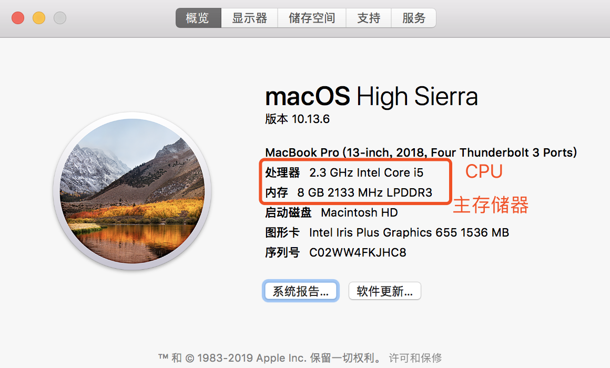
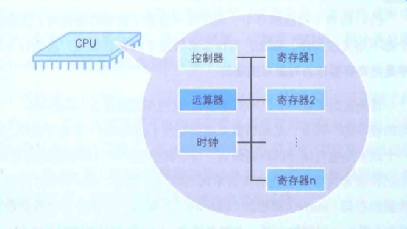

# 说说 CPU 层面的运作

由于事件循环涉及到 JS 单线程，JS 单线程又属于浏览器多进程、多线程的架构里面，因此，这一章主要讲讲 CPU 层面的概念，如进程、线程，以及 CPU 是如何执行一个程序（为后面谈及 JS 的运行机制做好铺垫）。

计算机的构成元件中，根据程序的指令来进行数据运算，并控制整个计算机的设备称作 CPU。

<u>CPU 的内部由寄存器、控制器、运算器和时钟四个部分构成。</u>**控制器**负责把内存上的指令、数据等读入**寄存器**，并根据指令的执行结果来控制整个计算机。**运算器**负责运算从内存读入寄存器的数据。**时钟**负责发出 CPU 开始计时的时钟信号。（2 GHz 表示时钟信号的频率为 2 GHz（1 GHz = 10 亿次/秒））。

