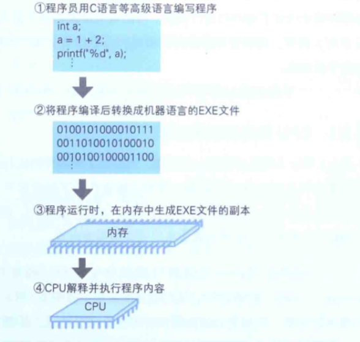
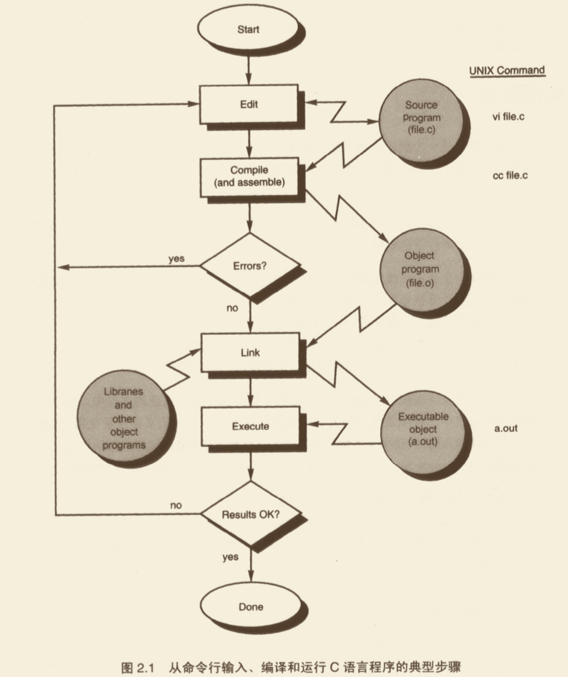
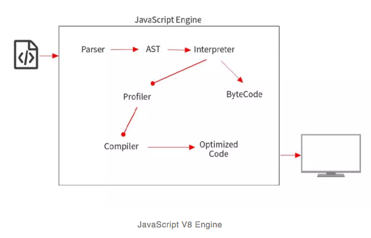

# CPU 是如何执行程序的

程序运行流程，使用高级语言编写的程序会在编译器编译后转化成机器语言，然后再通过 CPU 内部的寄存器来处理。



## 具体流程

1. <u>要编译一个使用高级语言编写的程序，我们首先要把这个程序输入到计算机文件中。</u>虽然在不同的计算机系统中，命名文件的习惯有所不同，但从总体上来说，文件名的选取还是由使用者决定。一般来讲，包含 C 语言程序的文件以 “.c” 两个字母作为文件名的结尾。因此，文件名 `main.c` 对于我们正在使用的计算机来说，可能就是一个合法的 C 语言程序文件名。
2. <u>我们通常文本编辑器把 C 语言编写的程序输入到计算机系统的文件中。</u>我们可以使用 vi(Unix 系统中一种编辑器)。使用稳步编辑器生成的文件包含了 C 语言程序的原始形式，因此通常称为源文件（source file）。程序一旦输入到源文件中，我们就可以着手来编译它了。
3. <u>为了开始编译输入的源文件，我们需要让计算机执行特定的命令。当我们再命令行中输入这个编译命令时，还必须在后面跟上源文件的名字。</u>在 Unix 操作系统中，开始编译 C 语言源文件的命令是 `cc`。如果使用的是 GNU C 编译器，那么启动编译器的命令则是 `gcc`。在命令行上输入下面的命令：(mac 就是 unix 系统的变种)

```bash
cc main.c
```



1. 在编译的第一阶段，<u>编译器首先检查源程序的每一条语句，看它是否符合语言的语法和词法。</u>如果编译器在这个阶段发现了错误，便会将这些错误报告给用户，然后停止运行。程序员必须实用文本编辑器改正这些错误，并重新开始编译。这一阶段发现的典型错误通常包括不匹配的括号（词法错误），或者实用了未定义的变量（语法错误）等。
2. <u>当程序中所有的语法和语义错误都被改正以后，编译器就会把高级语言编写的源程序翻译为较低级的形式。</u>在绝大多数计算机系统中，<u>这些高级语言程序通常首先被翻译为汇编语言程序</u>，这些汇编语言程序完成的功能与高级语言程序相同。
3. 源程序被翻译为对应的汇编语言程序之后，<u>编译器还需要将这些汇编语言程序翻译成为实际的机器指令。</u>这个步骤有时需要借助<strong>汇编器</strong>完成。在绝大多计算机系统中，编译器通常会自动调用汇编器。
4. <u>汇编器读入编译器生成的汇编语言程序，将其翻译为二进制格式的代码，这种代码被称为目标码。汇编器将这些生成的目标码保存在目标文件中。</u>在 Unix 操作系统中，目标文件通常使用与源文件相同的文件名保存，但是文件名的结尾不是`.c`，而是`.o`。在 Windows 操作系统中，目标文件的结尾则是 `.obj`。
5. 生成目标文件以后，我们就可以进行下一个步骤——“连接（Link）”了。如果我们实用的 Unix 平台下的 `cc` 命令或者 `gcc` 命令的话，这一步骤也是自动的。<u>连接的主要作用呢是将目标代码转化为具体的计算机系统呢上实际的可执行程序。如果我们在源程序中调用了其他程序的话，那么连接程序就会把这些程序的目标代码和我们的程序的目标代码连接在一起。如果我们的程序还实用了系统提供的库函数，这些库函数的代码也会被连接到最后生成的可执行程序中。</u>

编译和连接一个程序的过程也常常被称为构建（building）。

9. <u>连接步骤生成的可执行代码被连接器（Linker）保存在系统的可执行文件中。</u>在 Unix 环境中，连接器生成的可执行文件，其默认文件名是 `a.out`。在 Window 操作系统中，这个可执行文件的名字通常与源文件名字相同，但是其文件名的结尾是 `.exe`。
   为了运行生成的可执行文件，我们只需要简单在系统中命令行中输入下面的命令：

```bash
./a.out
```

这个命令将可执行文件装入计算机的内存呢，然后开始运行其中的指令。

10. 当程序开始运行后，计算机将会按顺序执行程序中的指令。<u>如果程序需要从用户那里接收某些数据（也就是输入），系统将暂时挂起程序，以便用户输入。有时程序也可以开始等待某些事件的发生，如鼠标点击等。</u>程序运行的结果通常输出到一个窗口中，这个窗口被称为终端（console）。有时程序也可以直接输出到系统文件中。

11. 如果一切顺利，程序将完成它的工作。<u>如果程序的结果不正确，那么我们需要回过头来重新分析程序，排除程序逻辑错误的过程为调试（debug）。</u>在调试过程中，我们通常需要修改源文件，这时我们还需要重新编译、连接，以生成可执行程序。这个调试过程不断重复，直到程序产生我们所需要的结果。

## JS 运行原理

JS 的运行原理和 C 语言差不多，也是一门高级语言，但是最终计算机能理解只有1和0。那么我们编写的代码是如何被计算机理解的呢？它是通过 JS 引擎（浏览器使用 V8 引擎）如下图：

```js
function add(a, b) {
  return;
  a + b;
}

for (let i = 0; i < 1000; i++) {
  add(1 + 1);
}
```



上图就是 JS Engine 内部的工作流程。我们输入的代码将通过以下阶段，

- Parser
- AST
- Interpreter 生成 ByteCode
- Profiler
- Compiler 生成优化后的代码

具体可以看看这篇文章：[https://mp.weixin.qq.com/s/W83ABsZOPWEflc1wFC0h2Q](https://mp.weixin.qq.com/s/W83ABsZOPWEflc1wFC0h2Q)）