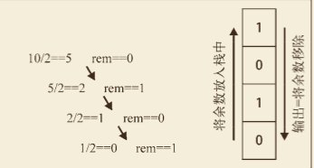
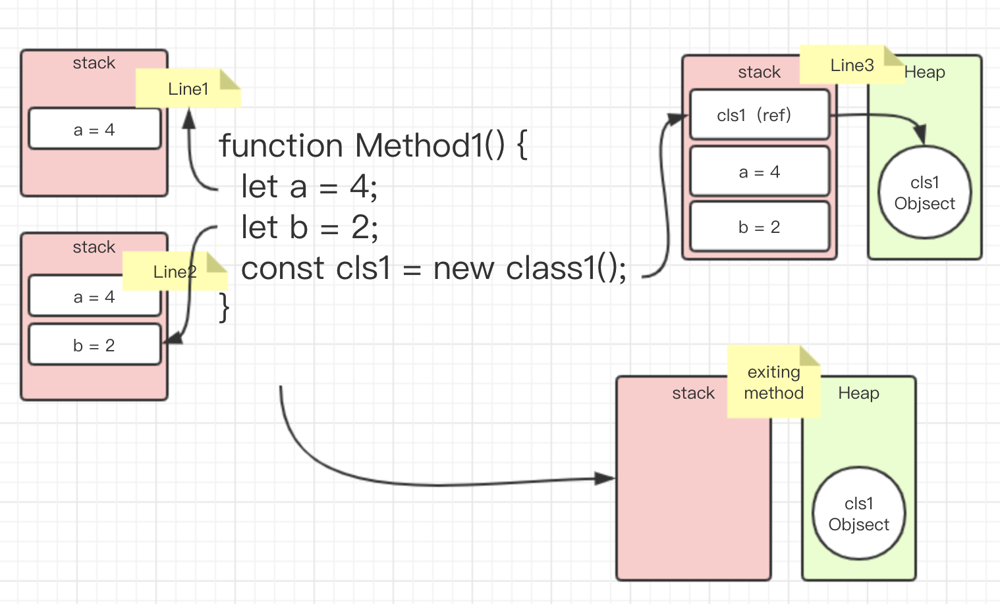

# 栈

栈是一种遵从后进先出（LIFO）原则的有序集合。新添加或待删除的元素都保存在栈的同一端，称作栈顶，另一端就叫栈底。在栈里，新元素都靠近栈顶，旧元素都接近栈底。

在现实生活中也能发现很多栈的例子。例如，下图里的一摞书或者餐厅里叠放的盘子。


## 利用数组创建一个栈

```js
// LIFO：只能用 push, pop 方法添加和删除栈中元素，满足 LIFO 原则
class Stack {
  constructor() {
    this.items = [];
  }
  /**
   * @description 向栈添加元素，该方法只添加元素到栈顶，也就是栈的末尾。
   * @param {*} element 
   * @memberof Stack
   */
  push(element) {
    this.items.push(element);
  }
  /**
   * @description 从栈移除元素
   * @returns 移出最后添加进去的元素
   * @memberof Stack
   */
  pop() {
    return this.items.pop();
  }
  /**
   * @description 查看栈顶元素
   * @returns 返回栈顶的元素
   * @memberof Stack
   */
  peek() {
    return this.items[this.items.length - 1];
  }
  /**
   * @description 检查栈是否为空
   * @returns
   * @memberof Stack
   */
  isEmpty() {
    return this.items.length === 0;
  }
  /**
   * @description 返回栈的长度
   * @returns
   * @memberof Stack
   */
  size() {
    return this.items.length;
  }
  /**
   * @description 清空栈元素
   * @memberof Stack
   */
  clear() {
    this.items = [];
  }
}
```

## 用栈解决问题

栈的实际应用非常广泛（只要满足 LIFO 规则的算法都可以使用栈来解决问题）。在回溯问题中，它可以存储访问过的任务或路径、撤销的操作。Java 和 C# 用栈来存储变量和方法调用，特别是处理递归算法时，有可能抛出一个栈溢出异常。


### 利用栈解决十进制转二进制的问题



```js
/**
 * 把十进制转换成二进制。
 * @param {*} decNumber 十进制
 */
export function decimalToBinary(decNumber) {
  const remStack = new Stack();
  let number = decNumber; // 十进制数字
  let rem; // 余数
  let binaryString = '';

  while (number > 0) {
    // 当结果不为0，获得一个余数
    rem = Math.floor(number % base); 
    remStack.push(rem); // 入栈
    number = Math.floor(number / base);
  }

  while(!remStack.isEmpty()) {
    binaryString += remStack.pop().toString();
  }
  return binaryString;
}
```

### 代码运行方式——调用栈

调用栈，表示函数或子例程像堆积木一样存放，以实现层层调用。
下面以一段 js 代码为例：
```js
class Student {
  constructor(age, name) {
    this.age = age;
    this.setName(name);
  }
  setName(name) {
    this.name = name;
  }
}
function main() {
  const s = new Student(23, 'Jonh')
}
main();
```
上面这段代码运行的时候，首先调用 main 方法，里面需要生成一个 Student 的实例，于是又调用 Student 构造函数。在构造函数中，又调用到 setName 方法。


这三次调用像积木一样堆起来，就叫做“调用栈”。程序运行的时候，总是先完成最上层的调用，然后将它的值返回到下一层调用。直至完成整个调用栈，返回最后的结果。

原理大概:
1. 调用 main 方法，这个时候需要调用 Student 构造函数，把这个位置A作为 return 地址存入栈中。
2. 这个时候调用并进入 Student 构造函数内部，遇到 SetName() 方法，把这里的位置B 作为 return 地址存入栈中记录下来存入栈中。
3. 这时调用并进入 setName() 方法内部执行完毕后，之后从栈中拿出 B 地址，返回到 Student 函数内部继续执行。
4. Student 函数执行完毕后，然后从栈中继续拿出 A 地址，进入到一开始的 main 函数内部执行，至此完毕。

#### 内存区域

程序运行的时候，需要内存空间存放数据。一般来说，系统会划分出两种不同的内存空间：一种是叫做 `stack` (栈)，另一种叫做 `heap`（堆）。一般来说，每个线程分配一个 `stack`，每个进程分配一个 `heap`，也就是说，`stack` 是线程独占的，`heap` 是现场共享的。此外，`stack` 创建的时候，大小是确定的，数据超过这个带下，就发生 `stack overflow` 错误。而 `heap` 的大小是不确定的，需要的话可以不断增加。

栈由系统自动分配释放，存放函数的参数值合局部变量的值等。

堆一般由程序员分配释放，若程序员不释放，程序结束时可能由 OS 回收。

根据上面这些区别，数据存放的规则是：只要是局部的、占用空间确定的数据，一般都存放在 `stack` 里面，否则就放在 `heap` 里面。请看下面这段代码：
```js
function Method1() {
  let a = 4;
  let b = 2;
  const cls1 = new class1();
}
```
上面的代码的 Method1 方法，共包含了三个变量：a，b 和 cls1。其中，i 和 y 的值是整数，内存占用空间是确定，而且是局部变量，只用在 Methods1 区块之内，不会用于区块之外。cls1 也是局部变量，但是类型为指针变量，指向一个对象的实例。指针变量占用的大小是确定的（这里存储的是地址），但是对象实例以目前的信息无法确知所占用的内存空间大小。

这三个变量和一个对象实例在内存中的存放方式如下：



从上图可以看到，`a、b `和 `cls1` 都存放在 `stack`，因为它们占用内存空间都是确定的，而且本身也属于局部变量。但是，`cls1` 指向的对象实例存放在 `heap`，因为它的大小不确定。

接下来的问题是，当 Method1 方法运行结束，会发生什么事？

回答是整个 `stack` 被清空，a、b 和 cls1 这三个变量消失，因为它们是局部变量，区块一旦运行结束，就没必要再存在了。而 `heap` 之中的哪个对象实例继续存在，直到系统的垃圾清理机制（`garbage collector`）将这块内存回收。因此，一般来说，内存泄漏都发生在 `heap`，即某些内存空间不再被使用了，却因为种种原因，没有被系统回收。

### 综合分析一段 JavaScript 代码（内存区域+调用栈）

递归算法中，变量和方法是如何入栈的，为什么有爆栈？或者说栈溢出？

1. **调用栈**

每当一个函数被一个算法调用时，该函数会进入调用栈的顶部。当使用递归时，每个函数调用都回堆叠在调用栈的顶部，这是因为每个调用都可能依赖前一个调用的结果。
```js
/**
 * 递归阶乘
 * @param {*} n 
 */
function factorial(n) {
  console.trace()
  if (n === 1 || n === 0) { // 基线条件
    return 1;
  }
  return n * factorial(n -1); // 递归调用
}
console.log('factorial(3) :', factorial(3));
```
我们可以用浏览器看到调用栈的行为，如下图所示


通过 debugger 可以看到每一次函数在推入栈，直接当 factorial(1) 被调用时，我们能在控制台得到下面的结果。
```
factorial	@	02-Factorial.js:20
factorial	@	02-Factorial.js:25
factorial	@	02-Factorial.js:25
```
当 factorial(1) 返回 1 时，调用栈开始弹出调用，返回结果，直到 3 * factorial(2) 被计算。

1. **JavaScirpt 调用栈大小的限制**

如果忘记加上用以停止函数递归调用的基线条件，会发生什么呢？递归并不会无限地执行下去，浏览器会抛出错误，也就是所谓的栈溢出错误。（stack overflow error）。

每个浏览器都有自己的上限，可用以下代码测试。
```js
// 测试浏览器的栈溢出错误，即超过最大调用栈
let i = 0;
function recursiveFn() {
  i++;
  recursiveFn();
}
try {
  recursiveFn();
} catch (ex) {
  console.log('i = ' + i + 'error: ' + ex);
}
```
在 Chrome 78 中，该函数执行了 15689 次，之后抛出错误 RangeError: Maximum call stack size exceeded（超限错误：超过最大调用栈大小）。

解决方案是可以使用尾递归优化。

## 总结

通过本小节，我们学习了栈这一数据结构的相关知识。我们用代码自己实现了栈，也讲解了栈的多种用处，其中执行栈跟JS运行机制密切相关。下一节将要学习队列，它和栈有很多相似之处，但是有个重要的区别，队列里的元素不遵循后进先出的规则。