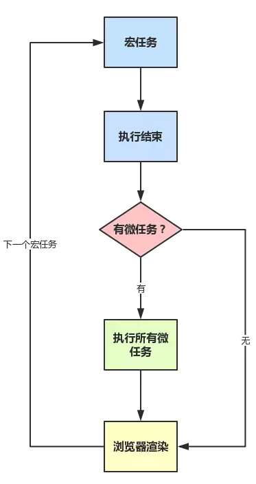

# Event loop 进阶：macrotask 与 microtask

上文中将 JS 事件循环机制梳理了一遍，在 ES5 的情况是够用了，但是在 ES6 盛行的现在，仍然会遇到一些问题，譬如下面这题：
```js
console.log('script start');

setTimeout(function() {
  console.log('setTimeout');
}, 0)

Promise.resolve().then(function() {
  console.log('promise1');
}).then(function() {
  console.log('promise2');
});

console.log('script end');
```
它的正确执行顺序是这样子的：
```
script start
script end
promise1
promise2
setTimeout
```

[https://jakearchibald.com/2015/tasks-microtasks-queues-and-schedules/]([https://jakearchibald.com/2015/tasks-microtasks-queues-and-schedules/)感兴趣的可以看这篇文章的动态例子。


为什么呢，因为 Promise 里有了一个新的概念：`microtask`。


或者，进一步，JS 中分为两种任务类型：`macrotask` 和 `microtask`，在 ECMAScript 中，microtask 称为 `jobs`，macrotask 可称为 `task`。

### 它们的定义？区别？简单点可以按如下理解：

- **macrotask（又称为宏任务），可以理解是每次执行栈执行的代码就是一个宏任务（包括每次从事件队列中获取一个事件回调并放到执行栈中执行）**
  - 每一个 `task` 会从头到尾将这个任务执行完毕，不会执行其它。
  - 浏览器为了能够使得 JS 内部 task 与 DOM 任务能够有序的执行，会在一个 `task`执行结束后，在下一个 `task` 执行开始前，对页面进行重新渲染（`task->渲染->task->...`）。
- **micortask（又称为微任务），可以理解是在当前 `task` 执行结束后立即执行的任务。**
  - 也就是说，在当前 `task` 任务后，下一个 `task` 之前，在渲染之前
  - 所以它的响应速度比 `setTimeout` （setTimeout 是 `task`），会更快，因为无需等渲染。
  - 也就是说，在某一个 `microtask` 执行完后，就会将它执行期间产生的所有 `micortask` 都执行完毕（在渲染前）。
微任务使得我们能够在重新渲染 UI 之前执行指定的行为，避免不必要的 UI 重绘，UI 重绘会使应用状态不连续。
```js
for (macroTask of macroTaskQueue) {
  // 1. Handle current MACRO-TASK
  handleMacroTask();

  // 2. Handle all MICRO-TASK
  for (microTask of microTaskQueue) {
      handleMicroTask(microTask);
  }
}
```

### 分别是什么样的场景会形成 macrotask 和 microtask 呢？

`macrotask` 和 `micortask` 表示异步任务的两种分类，在挂起时，JS 引擎回将所有的任务按照类别分到这两个队列中。
- **macrotask**：script（整体代码），`setTimeout`，`setInterval`，`setImmediate`，I/O，UI rendering等（可以看到，事件队列中的每一个事件都是一个 macrotask）。
- **microtask：**`Promise`（这里指浏览器实现的原生的 Promise），`process.nextTick` 、`Object.observe`、`MutationObserver`等。

补充：**在 node 环境下，process.nextTick 的优先级高于 Promise，**也就是可以简单理解为：在宏任务结束后会先执行微任务队列中的 `nextTickQueue` 部分呢，然后才会执行微任务中的 `Promise` 部分。

看下面的例子输出：
```js
process.nextTick(function() {
  console.log(4);
});

new Promise(function (resolve) { // 注意，new Promise是同步的，会马上执行function参数中的事情。
  console.log(1);
  resolve();
  console.log(2);
}).then(function() {
  console.log(5);
});

process.nextTick(function() {
  console.log(3);
})
/// 这段代码运行的结果是 1 2 4 3 5
/// process.nexTick 永远大于 promise.then，原因是在 Node 中，_tickCallback 在每一次执行完 TaskQueue 中的一个任务后被调用，而这个 _tickCallback 中实质上干了两件事：
// 1. nextTickQueue 中所有任务执行掉
// 2. 第一步执行完后执行 _runMicroTasks 函数，执行 microtask 中的部分（promise.then 注册的回调）
// 所以 process.nextTick > promise.then

```

### 结合线程来理解

- `macrotask` 中的事件都是放在一个事件队列中的，而这个队列由<strong>事件触发线程</strong>维护。
- `micortask` 中的所有微任务都是添加到微任务队列（Job Queues）中，等待当你 `macrotask `执行完毕后执行，而这个队列由 `JS 引擎线程维护`（因为它是在主线程下无缝执行的）。
如这里

所以，总结下运行机制：

一个浏览器环境（浏览器内核）只能有一个事件循环（Event loop），而一个事件循环可以有多个<strong>任务队列（Task queue）</strong>，每个任务都有一个任务源（Task source）（timer 的回调、鼠标事件等）
- 相同任务源的任务，只能放到一个任务队列中。
- 不同任务源的任务，可以放到不同任务队列中。
- 同一个任务队列中的任务必须按先进先出的顺序执行。

具体看 HTML 规范，HTML的事件循环吧。
[6.1.4 Event loops](https://html.spec.whatwg.org/multipage/webappapis.html#event-loops)

执行流程：
- 执行一个宏任务（栈中没有就从时间队列中获取）。
- 执行过程中如果遇到微任务，就将它添加到微任务的任务队列中。
- 宏任务执行完毕后，立即执行当前微任务队列中的所有微任务（依次执行）。
- 当前宏任务执行完毕，开始检查渲染，然后 GUI 线程接管渲染。
- 渲染完毕后，JS 线程继续接管，开始下一个宏任务（从事件队列中获取）。

如图：



另外，请注意下 `Promise` 的 `polyfill` 与官方版本的区别：

- 官方版本中，是标准的 `microtask` 的形式。
- polyfill，一般都是通过 `setTimeout` 模拟的，所以是 `macrotask` 形式。
- 请特别注意这两点区别

注意，有一些浏览器执行结果不一样（因为它们可能把 microtask 当成 macrotask 来执行了），请记住，有些浏览器可能不标准。
