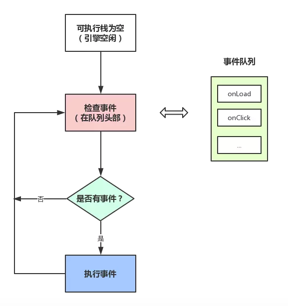

# 从 Event Loop 谈 JS 的运行机制

单线程 == 一个调用栈 == one thing at a time（一个时间点做一件事）

我们知道 JS 引擎是单线程的，这里会用到上文中的几个概念：

- JS 引擎线程
- 事件触发线程
- 定时触发器线程

然后再理解一个概念：

- JS 分为同步任务和异步任务。
- 同步任务都在主线程上执行难，形成一个`执行栈`。
- 主线程之外，**事件触发线程**管理着一个`任务队列`，只要异步任务有了运行结果，就在`任务队列`之中放置一个事件。
- 一旦`执行栈`中的所有同步任务执行完毕（此时 JS 引擎空闲），系统就会读取`任务队列`，将可运行的异步任务添加到可执行栈中，开始执行。 



看到这里，应该可以理解了：为什么有时候 setTimeout 推入的事件不能准时执行？因为可能在它推入到事件列表时，主线程还不空闲，正在执行其他代码，所以自然有误差。

## 一个简单例子

```js
// 事件循环
console.log('hi');
// setTimeout(function() {
//   console.log('there');
// }, 5000);
setTimeout(function() {
  console.log('there');
}, 0);
console.log("Jecyu");
```

可以进入可视化工具[loupe](http://latentflip.com/loupe/?code=bGV0IGEgPSAxOwogY29uc29sZS5sb2coYSkKICBmdW5jdGlvbiBtdWx0aXBseShhLCBiKSB7CiAgICAgIHJldHVybiBhICogYjsKICAgIH0gIAogICAgZnVuY3Rpb24gc3F1YXJlKG4pIHsKICAgICAgcmV0dXJuIG11bHRpcGx5KG4sIG4pOwogICAgfQogICAgZnVuY3Rpb24gcHJpbnRTdXFhcmUobikgewogICAgICBjb25zdCBzcXVhcmVkID0gc3F1YXJlKG4pOwogICAgICBjb25zb2xlLmxvZyhzcXVhcmVkKTsKICAgIH0KICAgIHByaW50U3VxYXJlKDQpOw%3D%3D!!!PGJ1dHRvbj5DbGljayBtZSE8L2J1dHRvbj4%3D)，粘贴下面代码，看事件循环工作流程。

## 进一步补充


上图描述就是：

- 主线程运行时会产生<strong>执行栈</strong>，栈中的代码调用某些 api 时，（当满足触发条件后，如 ajax 请求完毕）它们会在事件任务队列中添加各种事件。
- 而栈中的代码执行完毕，就会读取事件队列中的事件，去执行那些回调。
- 如此循环，“读取-处理-读取”
- 注意，总是要等待栈中的代码执行完毕后才会去读取事件队列中的事件。

### 单独说说定时器

上述事件机制的核心是：JS 引擎线程和事件触发线程。

但事件上，里面还有一些隐藏细节，譬如调用 `setTimeout` 后，是如何等待特定时间后才添加到事件队列中的？

它不是由 JS 引擎检测的，而是由<strong>定时器线程</strong>控制。

为什么要单独的定时器线程？因为 JavaScript 引擎是单线程的，如果处于阻塞状态就会影响记时器的准确，因此很有必要单独开一个线程用来计时。

什么时候会用到定时器线程？当使用 `setTimeout` 或 `setInterval` 时，它需要定时器线程计时，计时完成后就会将特定的事件推入事件队列中。

```js
setTimeout(function() {
  console.log('Jecyu');
}, 1000);
console.log("Hi");
```
这段代码的作用是当 `1000` 毫秒计时完毕后（由定时器线程计时），将回调函数推入事件队列中，等待主线程执行

```js
setTimeout(function() {
  console.log('Jecyu');
}, 0);
console.log("Hi");
```
这段代码的效果是最快的时间内将回调函数推入事件队列中，等待主线程执行。

注意：
- 执行结果：先`Hi` 后，`Jecyu`。
- 虽然代码的本意是0毫秒后就推入事件队列，但是 W3C 在 HTML 标准中规定，规定要求 `setTimeout` 中低于4ms的时间间隔算为4ms。（不过也有一说是不同浏览器有不同的最小时间设定)
- 就算不等待 4ms，就算假设0毫秒就推入事件队列，也会先执行`Hi`（因为只有可执行栈内空了后才会主动读取事件队列）。

### setTimeout 而不是 setInterval

用 `setTimeout` 模拟定期计时和直接使用 `setInterval` 是有区别的。

```js
function run() {
  console.log('Hi') // 执行代码需要时间，会导致误差
  setTimeout(function() {
    run();
  }, 1000)
}  
run();  
```

因为每次 setTimeout 计时到后就会去执行，然后执行一段时间后才会继续 setTimeout，中间就多了误差（误差多少与代码执行时间有关）

而 setInterval 则是每次都精确的隔一段时间推入一个事件（但是，事件的实际执行时间不一定就准确，还有可能是这个事件还没执行完毕，下一个事件就来了。
```js
setInterval(function() {
 // 如果这里花费时间很长的话（超过1s），将会导致一个问题，当前的事件还没执行完，后续的事件继续添加进来。
 // 那么后续的回调执行事件频率会小于 1s 的间隔进行触发，解决：可以使用 setTimeout 来模拟 setInterval 执行。
 setTimeout(function() { // 模拟执行时间
   console.log('Hi') 
 }, 2000);
}, 1000); 
```
执行分析如图：

而且 `setInterval` 有一些比较致命的问题就是：

- 累计效应（上面提到的），如果 `setInterval` 代码再（`setInerval`）再次添加到队列之前还没有完成执行，就会导致定时器代码连续运行好几次，而之间没有间隔。就算正常间隔执行，多个 setInterval 的代码执行时间可能会比预期小（因为代码执行需要一定时间）。
- 而且把浏览器最小化显示等操作时，`setInterval` 并不是不执行程序，它会把 `setInterval` 的回调函数放到队列中，等浏览器窗口再次打开时，一瞬间全部执行完。

所以，鉴于这么多问题，目前一般认为的最佳方案是：用 `setTimeout` 模拟 `setInterval`，或者特殊场合（做动画）直接用 `requestAnimationFrame`。

